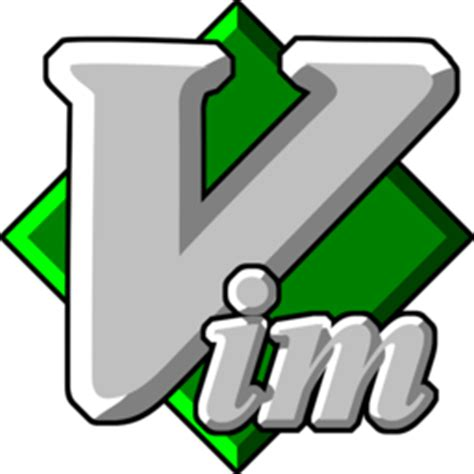

[![NPM Version][npm-image]][npm-url]
[![Build Status][travis-image]][travis-url]
[![Downloads Stats][npm-downloads]][npm-url]
[![Contributors][contributors-shield]][contributors-url]
[![Stargazers][stars-shield]][stars-url]
[![Issues][issues-shield]][issues-url]
[![License][license-shield]][license-url]

<!-- PROJECT LOGO -->
 

  

  <h3 align="center">README-Template</h3>

  

    An README template that is so addictive that you become lazy like me :smile:
     
    <a href="https://github.com/InsideU/ReadmeTemplate#about-the-project"><strong> Documentation »</strong></a>
     
     
    <a href="https://github.com/InsideU/ReadmeTemplate#about-the-project"> View Demo </a>
    ·
    <a href="https://github.com/InsideU/ReadmeTemplate/issues"> Report Bug </a>
    ·
    <a href="https://github.com/InsideU/ReadmeTemplate/pulls"> Send a Pull Request </a>
  

## Table of Contents

* [About the Project](#about-the-project)
  * [Built With](#built-with)
* [Getting Started](#getting-started)
  * [Plugins](#installation)
* [Handle](#handle)
* [License](#license)
* [Contact](#contact)
* [Study Guides](#guides)

## About The Project

[![Vim][product-screenshot]](https://www.vim.org/)

This is the personally created vim as per my comfortablity. Please be free changes based on you usuage and if require add extra functionalities

* Simplicity

Vim is a highly configurable text editor built to make creating and changing any kind of text very efficient. It is included as "vi" with most UNIX systems and with Apple OS X.

Vim is rock stable and is continuously being developed to become even better. Among its features are:

    persistent, multi-level undo tree
    extensive plugin system
    support for hundreds of programming languages and file formats
    powerful search and replace
    integrates with many tools

[![Vim][gif]]

## Getting Started 

> Explaining you the use of each Plugin so that you can decide which one to install and which one you don't need 

### Installation 

 * You are requested to install the vim vundle plugin so that you can install other plugin into the vim using that

# Handle 

> You just have to clone the .vimrc file after the vim vundle is install and then run :PluginInstall command 
> Then replace your .vim/bundle folder with the with the one given the repo

## Looking into the first Plugin 

* Nerd Tree 
 [![Nerd_Tree][tree]]
    This is the way to arrange the directory in the tree like structure as you can see on the left side of the screen

* Colorscheme
    I am using a royal colorscheme this is the reason i have a colorful screen text
    
* Devions 
    As you can see on the above picture in the nerd tree there is the icon for folder and programming languauge like c++ and py
    
* Powerline 
    The bar that you see the the bottom of the screen that contains information of the files including the programming language name used
    
* Auto pairs
    This just helps to auto pairs your brackets 
    
* Theme 
    I am using a onedark theme 
    
* fzf 
    It hels in fuzzy search i.e search anyfile direct from the editor itself

## License

> Feel free to circulate opensourced 

## Contact

Your Name - [@Umang](https://twitter.com/ssingh_umang) - umang20singh@gmail.com

<!-- MARKDOWN LINKS & IMAGES -->
[contributors-shield]: https://img.shields.io/github/contributors/InsideU/ReadmeTemplate.svg?style=flat-square
[forks-shield]: https://img.shields.io/github/forks/InsideU/ReadmeTemplate.svg?style=flat-square
[stars-shield]: https://img.shields.io/github/stars/InsideU/ReadmeTemplate.svg?style=flat-square
[issues-shield]: https://img.shields.io/github/issues/InsideU/ReadmeTemplate.svg?style=flat-square
[license-shield]: https://img.shields.io/github/license/InsideU/ReadmeTemplate.svg?style=flat-square
[linkedin-shield]: https://img.shields.io/badge/-LinkedIn-black.svg?style=flat-square&logo=linkedin&colorB=555
[product-screenshot]: images/vim1.png
[tree]: images/vim.png
[gif]: images/vim.gif

[npm-image]: https://img.shields.io/npm/v/datadog-metrics.svg?style=flat-square
[npm-downloads]: https://img.shields.io/npm/dm/datadog-metrics.svg?style=flat-square
[travis-image]: https://img.shields.io/travis/dbader/node-datadog-metrics/master.svg?style=flat-square
[wiki]: https://github.com/yourname/yourproject/wiki

[contributors-url]: https://github.com/InsideU
[forks-url]: https://github.com/InsideU/ReadmeTemplate/network/members
[stars-url]: https://github.com/InsideU/ReadmeTemplate/stargazers
[issues-url]: https://github.com/InsideU/ReadmeTemplate/issues
[license-url]: https://google.com
[npm-url]: https://npmjs.org/package/datadog-metrics
[travis-url]: https://travis-ci.org/dbader/node-datadog-metrics
